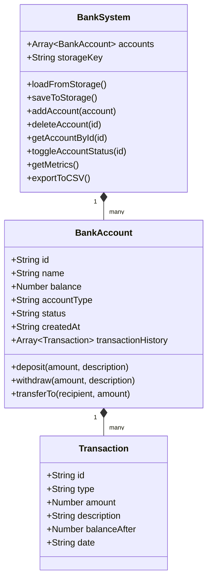

# Apex Bank Enterprise | Financial Management System


> An industry-grade, lightweight, and high-performance Web-based Financial Dashboard and Bank Account Management System built with modern Vanilla JavaScript, CSS3 Glassmorphism, and Semantic HTML5. Zero external framework dependencies required.

---

## 🌟 Overview

**Apex Bank Enterprise** is a modern, responsive web application designed for financial institutions and account managers to streamline client account registration, vault liquidity tracking, funds transfer, security freezes, and audit logging. 

It provides real-time banking analytics, persistent local storage, custom interactive modals, toast notifications, and standard CSV data export capabilities.

---

## ✨ Key Features

### 📊 Real-Time Financial Dashboard
- **Vault Liquidity Metrics**: Real-time aggregation of total bank funds across all customer accounts.
- **Key Performance Indicators**: Live tracking of total registered accounts, average account balance, and total processed transactions.

### 💳 Account Lifecycle & Management
- **Unique Account Identifier**: Auto-generates unique IDs (e.g. `ACC-1001`) to track customer profiles safely.
- **Account Tiers**: Supports **Savings Account (4.5% APY)** and **Current / Checking Account** types.
- **Security Lock (Freeze / Unfreeze)**: One-click toggle to freeze compromised accounts, preventing unauthorized withdrawals or transfers.

### 💸 Atomic Transactions & Fund Transfers
- **Cash Deposit & Withdrawal**: Perform balance updates with input validation and automated ledger recording.
- **Overdraft Guardrails**: Built-in validation prevents account balances from going negative or processing unauthorized amounts.
- **Account-to-Account Transfer**: Atomic funds transfer between any active accounts with instant double-entry transaction history logging.

### 📝 Audit Trail & Data Export
- **Timestamped Audit History**: Detailed transaction logs with unique reference IDs (`TX-984201`), operation type, balance snapshots, and exact timestamps.
- **CSV Data Export**: One-click download of full bank account directories and transaction metrics in `.csv` format.

### 🎨 Modern UX & UI Design
- **Glassmorphic Slate Theme**: Sleek, high-contrast dark theme designed with curated CSS design tokens (`#0b0f19`, `#151c2c`, emerald green `#10b981`).
- **Non-blocking Toast System**: Real-time user feedback notifications for successful deposits, security warnings, or validation errors.
- **Responsive Layout**: Fluid CSS grid and flexbox layout optimized across desktop, tablet, and mobile displays.

---

## 🛠️ Tech Stack & Architecture

- **Core Logic**: Vanilla JavaScript (ES6+ Object-Oriented Classes)
- **Styling & Layout**: Custom CSS3, CSS Custom Properties (Variables), Flexbox & Grid, Glassmorphism, Google Fonts (*Outfit* & *Inter*)
- **Markup**: HTML5 Semantic Architecture
- **Data Persistence**: HTML5 `localStorage` API (`apex_bank_accounts_v2`)
- **Icons**: Inline SVG Vector Icons

### Project Directory Structure

```text
Simple Bank Management/
├── README.md                      # Primary Project Documentation
└── Simple_Bank_Management/
    ├── index.html                 # Main Dashboard Semantic Markup & Modals
    ├── style.css                  # Custom Enterprise CSS Design System
    └── script.js                  # Modular OOP Business Logic & Event Handlers
```

---

## 🚀 Quick Start Guide

### Prerequisites
No node packages or build steps are needed! All you need is a modern web browser.

### Running Locally

1. **Clone or Download the Repository**:
   ```bash
   git clone https://github.com/Nsarkar-XLR8/Simple_Bank_Management.git
   cd "Simple Bank Management/Simple_Bank_Management"
   ```

2. **Launch with standard Local HTTP Server**:
   Using Python:
   ```bash
   python3 -m http.server 8080
   ```
   Or using Node `http-server` / Live Server:
   ```bash
   npx http-server -p 8080
   ```

3. **Access the Application**:
   Open your browser and navigate to `http://localhost:8080`.

---

## 📖 System Architecture & Class Model

The application follows clean Object-Oriented Programming (OOP) principles:



---

## 🔒 Security & Data Integrity

1. **XSS Prevention**: Custom string sanitizer (`escapeHTML`) escapes dynamic customer input before DOM rendering.
2. **Input Validation**: Ensures numeric inputs are strictly positive numbers (`amount > 0`).
3. **Atomic Operations**: Transfer logic ensures funds are only deducted from the source account if the withdrawal succeeds before depositing into the recipient account.
4. **Local Data Isolation**: Stores data in isolated client-side browser `localStorage`.

---

## 📄 License

Distributed under the MIT License. See `LICENSE` for more details.
